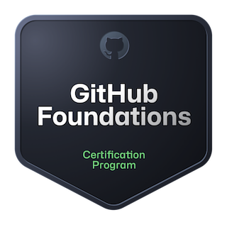

## 👋 Hi! I'm Marta — a frontend developer with a creative background, a designer’s eye, and usually a cat (or two) nearby. 

🧠 With a foundation in graphic design and illustration, I bring a unique perspective to crafting interfaces that are not just functional but also visually compelling. 

💻 These days, my main focus is frontend development — where I get to blend logic, design, and user experience. I'm especially passionate about where code and design meet — that space where form serves function.

🌱 I’m building on my skills in full stack development and UX design, with a core emphasis on frontend technologies and performance. 

🎮 Outside of coding, I love art, gaming (both video and board games), music, good food, and language learning (Japanese is my main focus, with some Korean and Finnish on the side!). 

🤝 Open to remote opportunities and collaborations, I bring technical expertise, creativity, empathy, and positive energy to every team I join. 

### 👩🏻‍💻 Let’s build something impactful and innovative together! 

    

## 💻 My Stack:
          

## Frameworks, tools and languages I'm currently learning:
      

# 🌱 Recent education: 
💻 <a href="https://keepcoding.io/nuestros-bootcamps/full-stack-web-bootcamp/" target="_blank">XVI KeepCoding Web Full Stack bootcamp</a> graduate (October 2024)  

# 🌐 Socials:
     

## 👩🏻‍💻 My coding profiles:
 

# 📊 GitHub Stats:
 
 

<!-- Proudly created with GPRM ( https://gprm.itsvg.in ) -->
